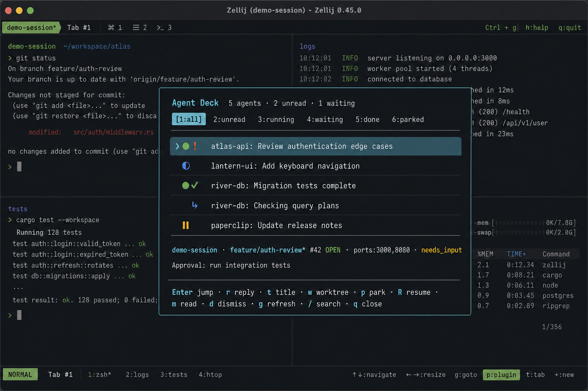

# Zellij Agent Deck

A floating, cross-session inbox and control surface for Codex agents. Codex
lifecycle hooks send bounded status records to a background Zellij plugin. The
plugin highlights panes that need attention and opens as a floating pane on
demand.

The project is currently pre-release; use the pinned `main` branch until the
first versioned release is tagged.

> [!IMPORTANT]
> This project is an independent integration for Codex and Zellij. It is not
> affiliated with or endorsed by OpenAI or the Zellij project.



_Synthetic demo with fictional sessions and task data._

## Requirements

- Linux
- Zellij 0.45.0
- Codex with lifecycle hooks enabled
- Nix with flakes enabled (recommended build and installation path)

The host bridge optionally uses `git`, `gh`, and `ss` to enrich agent records.

## Install

After cloning the repository, install it into the active Nix profile:

```console
nix profile install path:.
```

For a local build:

```console
nix build path:.
```

The package installs both host executables, the plugin at
`share/zellij/plugins/agent-deck.wasm`, and configuration examples under
`share/doc/zellij-agent-deck/examples`.

### Home Manager

The flake exports a Home Manager module that installs the package and plugin and
sets resurrection retention options:

```nix
{
  imports = [ inputs.zellij-agent-deck.homeManagerModules.default ];
  programs.zellij-agent-deck.enable = true;
}
```

It also exports `lib.mkCodexHooks`, `lib.mkCodexRequirements`, and
`lib.mkCodexWrapper`. These parameterized helpers let declarative configurations
reuse the same hook topology as `examples/hooks.json` without copying
machine-specific paths into this repository.

## Configure Zellij

Copy the relevant parts of [`examples/zellij.kdl`](examples/zellij.kdl) into
your Zellij configuration. Update the plugin path if it is not installed in
your Nix profile. The configuration loads one hidden plugin instance in each
session and binds `Alt a` to show or focus the floating deck.

Subagents are hidden by default. Set `show_subagents "true"` in the
`agent-deck` plugin configuration to show them initially. They are grouped
beneath their parent session with tree connectors when visible.

With Codex 0.150 or newer, the deck uses Codex's generated thread name as the
task title. The first prompt remains a temporary fallback while generation is
in progress. Codex's internal title-generation session is hidden from the
agent list, and a title set with `t` continues to override automatic names.

## Configure Codex hooks

Copy [`examples/hooks.json`](examples/hooks.json) to `~/.codex/hooks.json`, or
merge its event handlers into an existing hooks file. The bridge must be on the
hook process's `PATH`.

Codex requires non-managed hooks to be reviewed before they run. Open `/hooks`
in Codex after adding or changing the file, inspect the command, and trust it.

## Privacy and local state

The deck never writes complete prompts or transcripts. To make the inbox
useful, it does store bounded excerpts: the Codex-generated thread name (or a
normalized first-prompt fallback while no name is available) up to 72
characters, status details (up to 180 characters), paths, Zellij/Codex
identifiers, launcher commands, and Git metadata. Do not put secrets at the
start of prompts or in commands passed to approval dialogs.

Records are written with owner-only permissions to
`${XDG_RUNTIME_DIR:-/tmp}/zellij-agent-deck-$UID` and expire after 14 days.
Closed sessions leave the live deck immediately but remain available under the
`7:resume` filter until dismissed or expired. Set
`ZELLIJ_AGENT_DECK_STATE_DIR` to use another runtime location.

The plugin listens for Zellij pane-close events and periodically reconciles its
records with Zellij 0.45's structured pane list. This also catches force-closed
panes and dead Zellij sessions when no Codex shutdown hook can run.

## Keys

- `Enter`: jump to the exact session and pane
- `r`: compose and confirm a reply
- `t`: override the `project: task` title
- `w`: create a Git worktree and launch Codex in a new pane
- `p`: confirm parking with Ctrl-C; `R`: resume the Codex session
- `m`: mark read; `d`: dismiss
- `g`: refresh branch, dirty state, GitHub PR, and listening ports
- `s`: show or hide subagents for the current plugin instance
- `/`: search; `1`–`7`: status filters (`7` shows resumable sessions); `q`: close

## Codex launcher prefixes

The hook detects wrappers that remain in the Codex process ancestry. A session
started with `command-wrapper codex` is therefore resumed with
`command-wrapper codex resume`. Worktree launches reuse the same prefix.

For wrappers that replace themselves or otherwise cannot be detected, set the
prefix explicitly as a JSON argument array:

```console
ZELLIJ_AGENT_DECK_CODEX_PREFIX='["command-wrapper","--quiet"]' \
  command-wrapper --quiet codex
```

The deck records and propagates that prefix to resumed and worktree sessions.

## Exact Zellij resurrection

Agent Deck can make a plain `codex` command resume its exact Codex session when
Zellij resurrects a command pane. This remains unambiguous when multiple Codex
agents use the same working directory.

Create a `codex` launcher earlier on `PATH` than the real Codex executable. Set
`real_codex` to the absolute path of that executable to avoid wrapper recursion:

```bash
#!/usr/bin/env bash
exec zellij-agent-deck-codex codex-supervisor \
  --codex /absolute/path/to/real/codex -- "$@"
```

Add the resurrection hook alongside the existing Agent Deck hook under
`SessionStart`; [`examples/hooks.json`](examples/hooks.json) includes both:

```json
{
  "type": "command",
  "command": "zellij-agent-deck-codex hook",
  "timeout": 4
}
```

The launcher gives each zero-argument `codex` process in Zellij a stable token.
The `SessionStart` hook privately maps that token to the exact Codex session ID.
Explicit Codex arguments and non-Zellij launches pass directly to real Codex.

Mappings remain compatible with existing integrations at
`${XDG_STATE_HOME:-~/.local/state}/codex/zellij-sessions`. Successful lookup
refreshes a mapping's age. A normal Codex exit removes its mapping immediately;
terminating the Zellij session kills the supervisor and deliberately preserves
the mapping for resurrection. Garbage collection retains every token referenced
by an active or exited Zellij `session-layout.kdl`, then removes unreferenced
mappings older than seven days.

Cleanup runs automatically, at most once per day, when the supervisor starts.
No cron job or systemd timer is required. The explicit command remains useful
for diagnostics and immediate cleanup:

```console
zellij-agent-deck-codex gc
```

Override the grace period with `--retention-days` or
`ZELLIJ_AGENT_DECK_RESURRECTION_RETENTION_DAYS`. The state and Zellij cache
roots can be overridden with `ZELLIJ_AGENT_DECK_RESURRECTION_DIR` and
`ZELLIJ_AGENT_DECK_ZELLIJ_CACHE_DIR`, which is also useful for testing.

## Development

Enter the pinned development environment and install the Git hook once:

```console
nix develop
pre-commit install
```

Run the complete local gate at any time:

```console
pre-commit run --all-files
nix flake check path:.
```

The pre-commit gate checks file hygiene, private keys and secrets, Python lint,
formatting and types, Rust formatting and Clippy, unit tests, and Nix formatting
and evaluation. Flake checks independently build the package and run the Python
and Rust tests. See [`CONTRIBUTING.md`](CONTRIBUTING.md) for the contribution
workflow.

## License

MIT. See [`LICENSE`](LICENSE).
